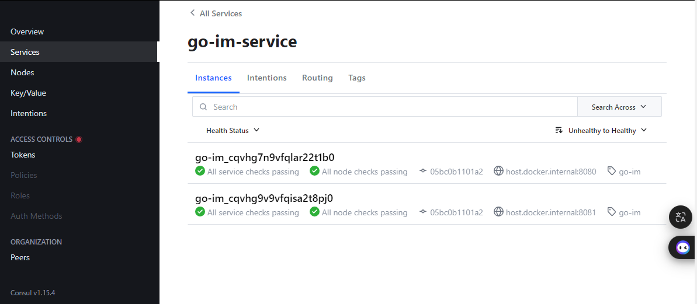
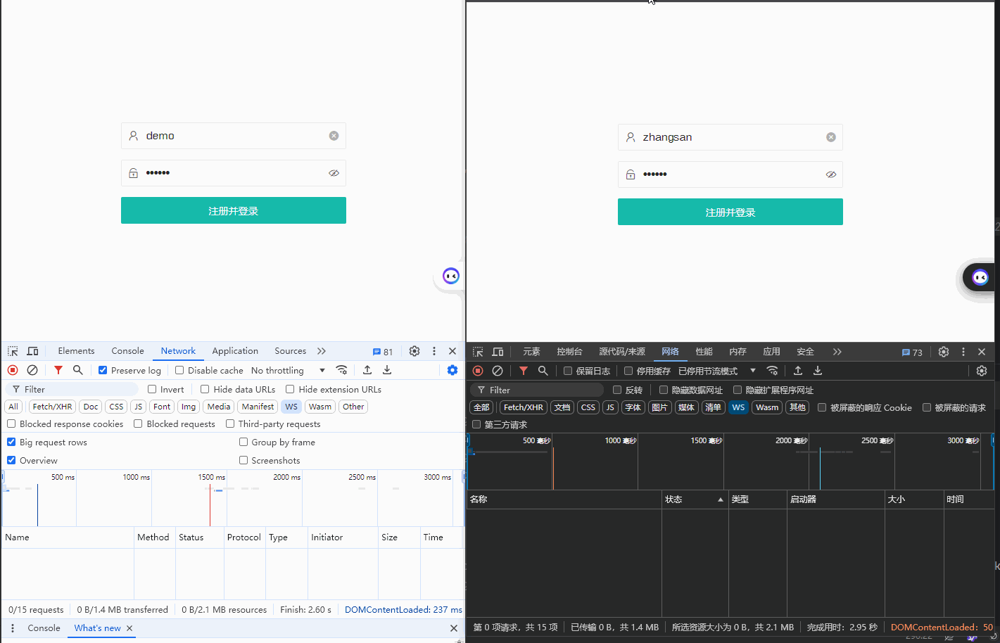
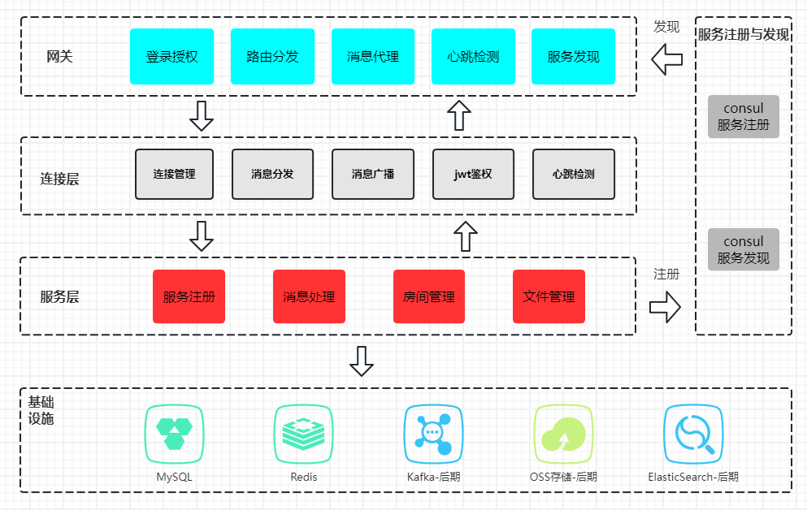
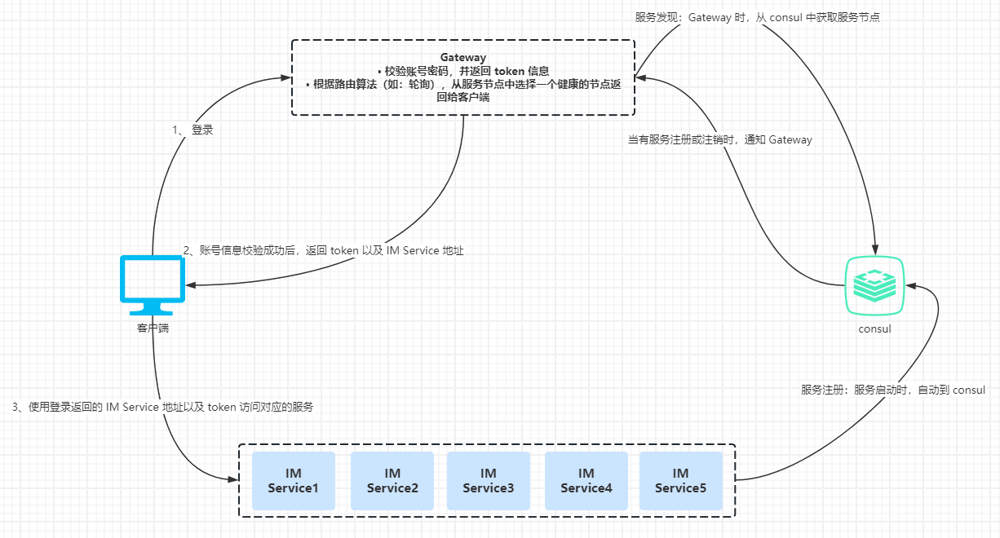

## 支持百万连接的 IM 系统
一个支持横向扩展的 IM 系统，当新增 IM Service 节点时自动注册到注册中心，Gateway 实时获取已注册的服务节点，根据路由算法将服务节点分配给客户端，实现 IM Service 的负载均衡。


### 部署

------------

#### 方式一、docker

项目根目录执行下面指令：

```shell
# 构建 gateway 镜像
docker build -t goim/gateway -f ./deployment/gateway/Dockerfile .
# 构建 service 镜像
docker build -t goim/service -f ./deployment/service/Dockerfile .

# 启动容器
docker-compose up -f docker/docker-comopse.yml -d
```

#### 方式二、手动安装

安装依赖，如果已安装直接跳过

```shell
# redis、mysql、consul 都是使用默认端口，如果与本地的服务冲突，需要修改端口
docker-compose -f docker/docker-compose.yml up -d 
```

```shell
# 编译
go mod tidy
go build -o ./dist/service ./cmd/service/main.go
go build -o ./dist/gateway ./cmd/gateway/main.go

# 运行网关
./dist/gateway
# 运行两个 service
./dist/service -a :8080
./dist/service -a :8081
```

#### 启动

前端地址：http://127.0.0.1:9001/

consul后台：http://127.0.0.1:8500

启动的两个 IM Service 服务已经注册到 consul 中



测试服务节点轮询路由分发



### 角色及职责

------------



**网关层**

+ 登录授权：负责登录和注册，并返回 token 给客户端
+ 路由分发：从注册中心中获取已注册的 IM Service节点，根据路由算法从服务节点列表中选择一个合适的 IM Service节点返回给客户端。可以实现复杂的路由分发，如：根据房间ID，将用户分发到特定的 IM 服务集群
+ 消息代理：负责将  IM Service 节点的消息，转发到其他节点。如：广播消息、消息转发
+ 心跳检测：定时检查 IM Service 节点的连接状态
+ 服务发现：实时从注册中心中获取最新的服务节点列表

**连接层**

+ 管理客户端的长连接，维护连接的健康状态，处理 TCP 和 WebSocket 连接的建立与断开
+ 进行 JWT 鉴权，校验用户的合法性
+ 将客户端或网关层的消息分发到服务层处理，并将服务层的处理结果返回客户端或网关层

**服务层**

+ 服务注册：服务启动时，将服务到注册中心，便于网关层能对服务进行统一管理
+ 消息处理：根据不同的消息类型，进行对应的逻辑处理，消息投递、消费、缓存等
+ 房间管理：房间创建、维护每个房间的用户、房间状态等信息
+ 文件管理：对文件进行次持久化处理，如：上传到 OSS 或自搭本地的 aws_s3

### 设计思路

------------



扩展性与容错性设计
+ 分布式架构： im 服务实例可以水平扩展，Gateway 的路由服务，实现 im 服务实例直接的负载均衡
+ 负载均衡架构： 同时可以把im节点分组，通过ng负载均衡，保证 接入层的高可用性

### 后期开发安排优先级

1. 服务解耦，将连接层和业务层进行分离。目前代码，连接层和业务层耦合在一起，不便于后期代码的维护升级
2. 解决消息可靠性问题。由于网络的复杂性，TCP 自带的可靠性策略，无法满足需求。需要对消息进行ack确认，重新投递失败或超时消息，客户端需要对消息进行幂等处理。
3. 解决消息顺序一致性问题。计划用：时间戳+服务端序号方案解决
4. 消息压缩，如：protocol buffers，Thrift 等。由于连接层与网关层需要频繁通信，而且网关层需要承担消息转发的功能，数据量可能比较大，因此需要对消息进行压缩，减少服务器、带宽的压力。
5. 优化前端UI
5. 开发服务层没有完成的功能
5. 连接层和网关层之间，后期可能使用 grpc 协议进行通信

### 功能特性

------------

- [x] 网关层
    - [x] 登录授权
    - [x] 路由分发
    - [x] 消息代理
    - [x] 心跳检查
    - [x] 服务发现
- [x] 连接层
    - [x] 连接管理
    - [x] 消息分发
    - [x] 消息广播
    - [x] JWT鉴权
    - [x] 心跳检测

- [x] 服务层
  - [x] 服务注册
  - [x] 房间管理（用户列表、消息发送）
  - [x] 文本消息
  - [ ] 文件消息
  - [ ] 表情消息
  - [ ] gif消息
  - [ ] 聊天记录管理
  - [ ] 消息敏感词过滤
  - [ ] 离线消息同步

